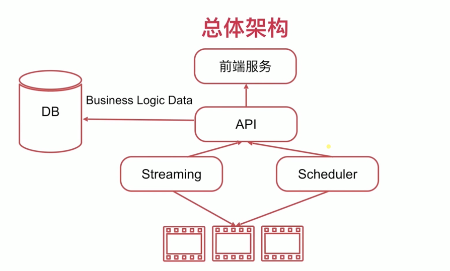

# StmSrv: streaming server

> **Note**  
> 本项目目前仅用于学习

流媒体点播服务

https://blog.csdn.net/weixin_52723461/article/details/120277314?csdn_share_tail=%7B%22type%22%3A%22blog%22%2C%22rType%22%3A%22article%22%2C%22rId%22%3A%22120277314%22%2C%22source%22%3A%22weixin_52723461%22%7D

# LICENSE
[MIT](tps://github.com/JIeJaitt/stmsrv/blob/5aea553bd697a9906484eae470eac5b10123e9f8/LICENSE)

